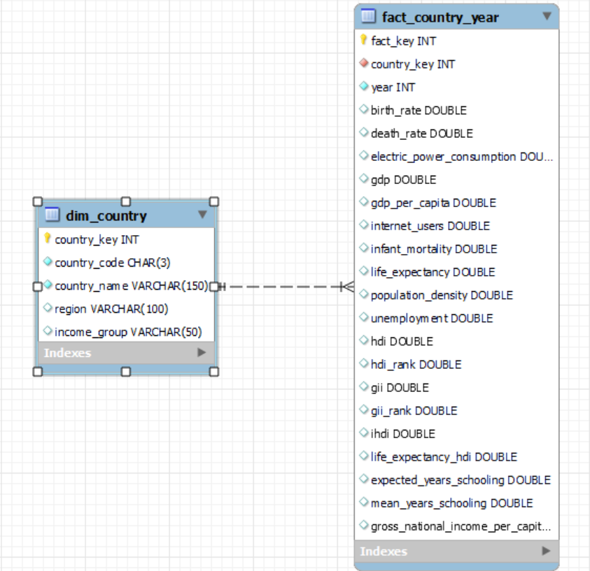
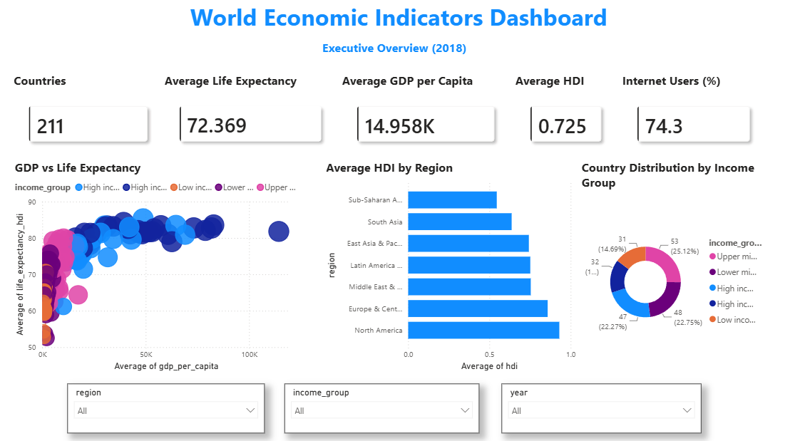
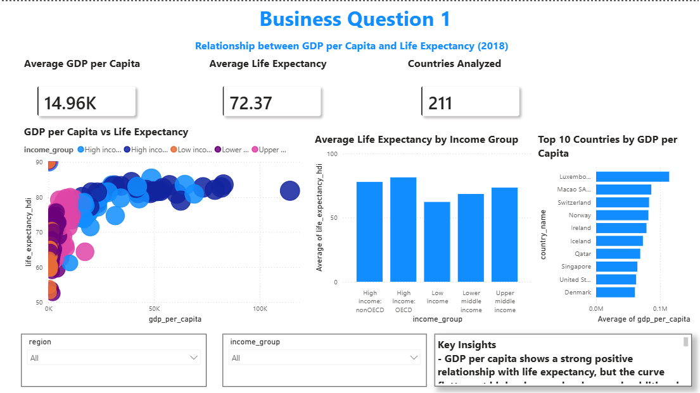
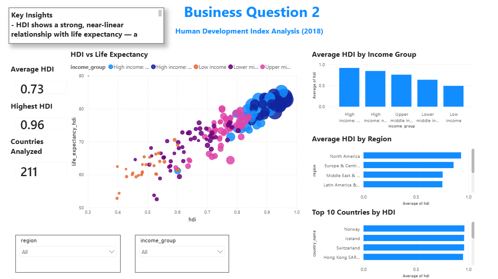
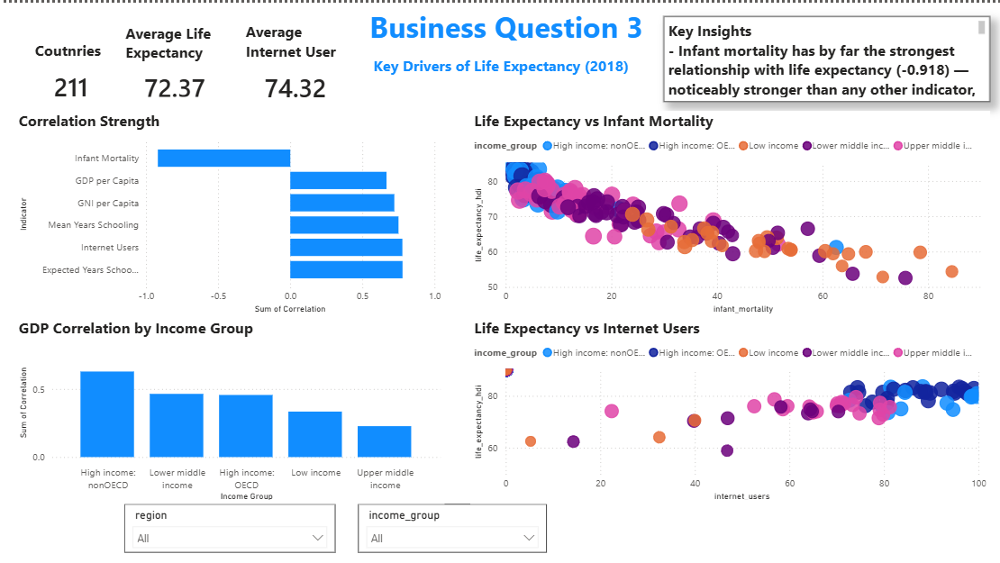

# 🌍 World Economic Indicators Analytics | End-to-End Data Analytics Project

**ETL • SQL • MySQL • Power BI • Python • Data Warehousing • Business Intelligence**


## 📌 Executive Summary

This project presents an end-to-end data analytics solution built on World Bank and Human Development Index (HDI) datasets to analyze global economic and social development trends. The workflow covers the complete analytics lifecycle—from data ingestion, profiling, and cleaning using Python, to dimensional data modeling in MySQL, SQL-based business analysis, and interactive dashboard development in Power BI. The final solution enables stakeholders to explore relationships between economic indicators, human development, and quality-of-life metrics across countries, regions, income groups, and years.

## 🎯 Business Problem

Governments, policymakers, researchers, and international organizations rely on economic and human development indicators to evaluate a country's progress. However, these datasets are often dispersed across multiple sources, contain missing values, inconsistent formats, and require extensive preprocessing before meaningful analysis can be performed.

The objective of this project was to integrate, clean, and transform these datasets into a structured analytical model that supports business intelligence and data-driven decision-making. Using SQL and Power BI, the project answers key analytical questions such as:

- How does GDP per capita relate to life expectancy?
- How does Human Development Index (HDI) vary across regions and income groups?
- Which socio-economic indicators have the strongest relationship with life expectancy?
- How do development trends differ between countries over time?

The resulting dashboards provide an interactive platform for exploring global development patterns and deriving actionable insights from complex socio-economic data.

## 📂 Dataset Overview

This project integrates data from two publicly available global development datasets:

| Dataset | Source | Description |
|----------|--------|-------------|
| World Development Indicators | World Bank | Economic, demographic, infrastructure, and social indicators for countries across multiple years. |
| Human Development Index (HDI) | United Nations Development Programme (UNDP) | Human development metrics including HDI, life expectancy, expected years of schooling, mean years of schooling, and Gross National Income (GNI) per capita. |

### Dataset Highlights

- **211** countries and territories
- **2000–2021** analysis period (depending on indicator availability)
- **15+** World Bank indicators
- **HDI indicators** integrated using ISO country codes
- Multi-source data integration for comprehensive socio-economic analysis

## ⚙️ ETL Pipeline

The project follows a structured ETL (Extract, Transform, Load) workflow to convert raw datasets into an analytics-ready data warehouse.

### Extract
- Imported World Bank and HDI datasets using Python (Pandas)
- Loaded Excel and CSV files into the analysis environment
- Performed initial data profiling and quality assessment

### Transform
- Standardized country names and ISO country codes
- Handled missing values using documented preprocessing strategies
- Corrected data types and standardized column formats
- Merged World Bank and HDI datasets
- Created analytical features required for reporting
- Validated data integrity before loading

### Load
- Designed a dimensional data model (Star Schema)
- Loaded cleaned data into MySQL
- Created fact and dimension tables
- Prepared the warehouse for SQL analytics and Power BI reporting

## 🏛️ Data Warehouse Design

To enable efficient analytical querying, the cleaned datasets were transformed into a **Star Schema** within MySQL.

### Dimension Tables

- **dim_country** – Country, Region, Income Group
- **dim_date** – Year
- **dim_hdi** – Human Development indicators

### Fact Table

- **fact_country_year**
  - GDP
  - GDP per Capita
  - Life Expectancy
  - Infant Mortality
  - Internet Users
  - Electric Power Consumption
  - Unemployment Rate
  - Population Growth
  - HDI Metrics

This dimensional model minimizes redundancy while enabling fast aggregation, filtering, and reporting within SQL and Power BI.

### 📌 Star Schema Diagram

The analytical database follows a **star schema** design, consisting of a centralized **fact table (`fact_country_year`)** linked to the **country dimension (`dim_country`)**. This dimensional model optimizes analytical queries and serves as the foundation for Power BI reporting.

<p align="center">
  
</p>

*Figure: Star schema implemented in MySQL for analytical reporting.*

## 🗄️ SQL Business Analysis

After loading the data warehouse into MySQL, SQL was used to answer key business questions and generate insights.

### Business Question 1
**How does GDP per Capita influence Life Expectancy?**

- Compared economic prosperity with health outcomes
- Identified trends across countries and income groups

---

### Business Question 2
**How does Human Development vary across regions and income groups?**

- Compared HDI distribution globally
- Identified high-performing and developing regions
- Ranked countries based on HDI

---

### Business Question 3
**Which socio-economic indicators have the strongest relationship with Life Expectancy?**

Correlation analysis revealed:

| Indicator | Correlation |
|-----------|------------:|
| Infant Mortality | **-0.918** |
| Expected Years of Schooling | **0.778** |
| Internet Users | **0.777** |
| Mean Years of Schooling | **0.750** |
| GNI per Capita | **0.721** |
| GDP per Capita | **0.667** |

These SQL analyses formed the foundation of the interactive Power BI dashboards and business insights presented in the project.

## 📊 Power BI Dashboard

The final dashboard transforms the analytical results into an interactive business intelligence solution, enabling users to explore global development trends across countries, regions, income groups, and years.

### Dashboard Pages

### 📍 Executive Overview
**Purpose:** Provide a high-level snapshot of global economic and development indicators.

**Key Visuals**
- KPI Cards
- GDP vs Life Expectancy Scatter Plot
- HDI by Region
- Income Group Distribution
- Interactive Year & Region Filters

<p align="center">
  
</p>

*Figure: Executive Overview dashboard presenting key global economic and human development indicators.*

---

### 📍 GDP & Life Expectancy Analysis
**Purpose:** Examine the relationship between economic prosperity and health outcomes.

**Key Visuals**
- GDP vs Life Expectancy Scatter Plot
- Average GDP by Income Group
- Top Countries by GDP per Capita
- Business Insights Panel

<p align="center">
  
</p>

*Figure: GDP Analysis dashboard highlighting relationships between GDP, GDP per capita, life expectancy, and regional economic performance.*

---

### 📍 Human Development Analysis
**Purpose:** Compare HDI performance across regions and income groups.

**Key Visuals**
- HDI by Region
- HDI by Income Group
- Top Countries by HDI
- Business Insights Panel

<p align="center">
  
</p>

*Figure: HDI Analysis dashboard exploring human development trends, regional comparisons, and key socioeconomic indicators.*

---

### 📍 Correlation Analysis
**Purpose:** Identify the socio-economic indicators most strongly associated with life expectancy.

**Key Visuals**
- Correlation Ranking
- Infant Mortality vs Life Expectancy
- Internet Usage vs Life Expectancy
- GDP Correlation by Income Group

<p align="center">
  
</p>

*Figure: Correlation Analysis dashboard examining relationships between economic and human development indicators through correlation matrices and comparative visualizations.*

## 📈 Key Business Insights

The analysis revealed several important global development patterns:

- Healthcare indicators, particularly **Infant Mortality**, exhibit the strongest relationship with Life Expectancy, outperforming traditional economic indicators.
- Education and digital connectivity demonstrate stronger associations with population health than GDP per Capita alone.
- The relationship between economic prosperity and health outcomes varies significantly across income groups, highlighting that development challenges are context-specific.
- Human Development Index (HDI) provides a more comprehensive measure of societal well-being than income alone by combining health, education, and economic dimensions.
- Interactive Power BI dashboards enable users to explore these patterns dynamically across countries, regions, income groups, and years.

## 🏗️ Repository Structure 

World-Economic-Indicators-Analytics/
│
├── dashboard/
│   └── World_Economic_Indicators.pbix
│
├── data/
│   ├── raw/
│   ├── interim/
│   └── processed/
│
├── notebooks/
│   ├── 01_Data_Profiling.ipynb
│   └── 02_Data_Cleaning.ipynb
│
├── reports/
│   ├── 01_Data_Profiling_Report.md
│   ├── 02_Data_Cleaning_Report.md
│   └── 03_Data_Modeling_Report.md
│
├── sql/
│   ├── 01_Data_Loading.sql
│   ├── 02_Data_Modeling.sql
│   ├── 03_Business_Query_01.sql
│   ├── 04_Business_Query_02.sql
│   └── 05_Business_Query_03.sql
│
├── src/
│   └── __init__.py
│
├── requirements.txt
├── .gitignore
├── LICENSE
└── README.md

## 🛠️ Tech Stack

| Category | Technologies |
|----------|--------------|
| Programming Language | Python |
| Data Processing | Pandas, NumPy |
| Data Visualization | Matplotlib, Seaborn, Power BI |
| Database | MySQL |
| Query Language | SQL |
| Development Environment | Jupyter Notebook, VS Code |
| Version Control | Git, GitHub |
| Data Formats | CSV, XLSX |

## 🚀 Installation

```bash
git clone https://github.com/Aadish-code-create/world-economic-indicators-analytics.git
cd World-Economic-Indicators-Analytics
pip install -r requirements.txt
```

## ▶️ Usage

1. Open the Jupyter notebooks to explore the ETL pipeline.
2. Execute the SQL scripts to create the MySQL data warehouse.
3. Open the Power BI (.pbix) file to interact with the dashboard.

## 💡 Skills Demonstrated

- Data Cleaning & Preprocessing
- Exploratory Data Analysis (EDA)
- ETL Pipeline Development
- Dimensional Data Modeling (Star Schema)
- SQL Analytics & Business Querying
- Data Warehousing (MySQL)
- Dashboard Development (Power BI)
- Data Visualization
- Business Intelligence
- Version Control (Git & GitHub)

## 👨‍💻 About the Author

Hi, I'm **Aadish Kumar**, a Computer & Communication Engineering graduate with a strong interest in Data Analytics, Business Intelligence, and Financial Technology (FinTech).

I enjoy building end-to-end analytics solutions that transform raw data into actionable business insights using Python, SQL, MySQL, and Power BI.

If you have any feedback, suggestions, or collaboration opportunities, feel free to connect with me.

- **GitHub:** https://github.com/Aadish-code-create
- **LinkedIn:** https://www.linkedin.com/in/aadish-kumar-7b8256402/

## 🚀 Future Improvements

- Automate the ETL pipeline using Apache Airflow.
- Integrate additional World Bank indicators for deeper analysis.
- Deploy an interactive dashboard using Power BI Service or Streamlit.
- Implement data quality validation checks within the ETL process.
- Enable scheduled data refreshes for near real-time reporting.